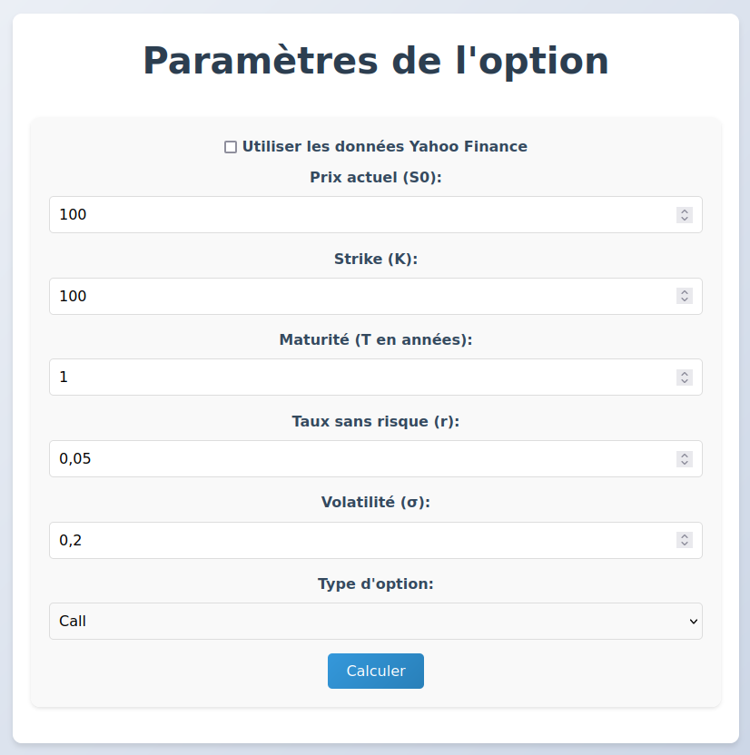

# OptionP

L'objectif de ce projet est de créer une application web permettant de calculer le prix d'une option européenne à l'aide du modèle de Black-Scholes et de Monte Carlo. En effet, ces deux modèles sont complémentaires.
Pour cela, je vais utiliser Flask, NumPy et SciPy.

Pour rappel, le modèle de Black-Scholes permet de calculer le prix théorique d'une option européenne (call ou put) en fonction de plusieurs paramètres.
Les options européennes, contrairement aux options américaines, ne peuvent être exercées qu'à la date d'expiration.



## Installation

1. Cloner le dépôt :
```bash
git clone https://github.com/votreusername/OptionP.git
cd OptionP
python3 -m venv venv
source venv/bin/activate
pip install --upgrade pip
pip install -r requirements.txt
flask run
```

## Modèle de Black-Scholes
Le modèle de Black-Scholes est un modèle mathématique utilisé pour calculer le prix théorique des **options européennes**. Il a été développé en **1973** par **Fischer Black** et **Myron Scholes**, avec des contributions importantes de **Robert C. Merton**. Leur travail a révolutionné la finance quantitative et leur a valu le **prix Nobel d'économie en 1997**.

Les hypothèses du modèle de Black-Scholes sont les suivantes :
- Le rendement de l'actif sous-jacent suit un processus log-normal avec une volatilité constante.
- Les marchés sont efficients et il n'y a pas de coûts de transaction, ni de taxes.
- Le taux sans risque et la volatilité sont constants dans le temps.
- Il n'y a pas de possibilité d'arbitrage.
- Le modèle s'applique à des options européennes, exercées uniquement à maturité.

### Formule pour le prix d'un call (option d'achat)

C = S0 * N(d1) - K * exp(-r * T) * N(d2)
>Ce premier terme représente l'espérance de gain liée à la détention de l'actif sous-jacent, pondérée par la probabilité que l'option expire dans la monnaie.

> Ce deuxième terme représente la valeur actuelle du prix d'exercice, ajustée par la probabilité que l'option expire dans la monnaie.

avec les calculs suivants :
d1 = (ln(S0 / K) + (r + (σ^2) / 2) * T) / (σ * sqrt(T))
d2 = d1 - σ * sqrt(T)

et les variables suivantes :
- `C` : Prix de l'option call
- `P` : Prix de l'option put
- `S0` : Prix actuel de l'actif sous-jacent
- `K` : Prix d'exercice de l'option (strike price) = prix auquel l'option peut être exercée
- `r` : Taux d'intérêt sans risque (annualisé)
- `T` : Temps restant jusqu'à l'expiration de l'option (en années)
- `σ` : Volatilité annuelle de l'actif sous-jacent
- `N(.)` : Fonction de répartition de la loi normale centrée réduite

## Exemple numérique
Supposons les valeurs suivantes :
- `S0` = 100 (prix actuel de l'actif)
- `K` = 100 (prix d'exercice)
- `r` = 0.05 (taux d'intérêt de 5 %)
- `T` = 1 (1 an pour la date d'expiration)
- `σ` = 0.2 (volatilité de 20 %)

Alors :
- `d1` = 0.35
- `d2` = 0.15

Il vient que le prix du call est :
- `C` = 100 * 0.6368 - 100 * exp(-0.05*1) *0.5596 = 10.45

En ayant utilisé les valeurs de la fonction de répartition de la loi normale :
- `N(0.35)` ≈ 0.6368
- `N(0.15)` ≈ 0.5596

Le prix théorique du call est donc de **10.45e**.
> Ainsi si un livre vaut 100e aujourd'hui, que l'on pense que dans 1an, il vaudra 120, on peut prendre un call avec un prix d'exercice de 100e pour 10,45e. Cela signifie que si le livre vaut 120e dans 1an, on pourra l'acheter pour 100e. On aura donc gagné 9,55e (120-100-10,45). Et par exemple, on peut le revendre 120e. Cela signifie que l'on a gagné 9,55e pour un investissement de 10,45e. Cela représente un rendement de 91.8%.

> Pour rappel, cela signifie qu'un investisseur devrait payer environ 10.45 aujourd'hui pour avoir le droit (pas l'obligation) d'acheter l'actif à 100 dans 1 an, compte tenu des paramètres actuels.

### Formule pour le prix d'un put (option de vente)

P = K * exp(-r * T) * N(-d2) - S0 * N(-d1)

## Grecques (Greeks)
Les Grecques sont des mesures de sensibilité qui indiquent comment le prix d'une option réagit aux changements de différents facteurs. Ils sont nécéssaires pour la compréhension des risques et des options.

### Delta (Δ)
Δcall​ = N(d1)
Δput​ = N(d1) - 1
Avec N(d1) est la fonction de répartition de la loi normale centrée réduite.

Le Delta mesure la sensibilité du prix de l'option par rapport au prix de l'actif sous-jacent.

Pour un call, le Delta est compris entre 0 et 1.
Pour un put, le Delta est compris entre -1 et 0.
> Un Delta de 0.6 signifie que si le prix de l'actif sous-jacent augmente de 1 €, le prix du call augmentera de 0.60 €.

### Gamma (Γ)
Γ = N'(d1) / (S0 * σ * sqrt(T))
Avec N'(d1) la densité de probabilité de la loi normale centrée réduite.

Le Gamma mesure la sensibilité du Delta par rapport au prix de l'actif sous-jacent. Un Gamma élevé signifie que le Delta est très sensible aux mouvements du sous-jacent.

## Vega(ν)
ν = S0 * N'(d1) * sqrt(T)
Le Vega mesure la sensibilité du prix de l'option par rapport à la volatilité de l'actif sous-jacent.

Exemple : Un Vega de 0.25 signifie que si la volatilité augmente de 1 %, le prix de l'option augmentera de 0.25 €.

## Theta(θ)
Pour un call:
θ = - (S0 * N'(d1) * σ) / (2 * sqrt(T)) - r * K * exp(-r * T) * N(d2)
Pour un put:
θ = - (S0 * N'(d1) * σ) / (2 * sqrt(T)) + r * K * exp(-r * T) * N(-d2)

Le Theta mesure la sensibilité du prix de l'option par rapport au temps qui passe.
Exemple : Un Theta de -0.05 signifie que le prix de l'option diminue de 0.05 € chaque jour.

## Rho(ρ)
Pour un call:
ρ = K * T * exp(-r * T) * N(d2)
Pour un put:
ρ = - K * T * exp(-r * T) * N(-d2)

Le Rho mesure la sensibilité du prix de l'option par rapport au taux d'intérêt sans risque.

## Monte Carlo
Le modèle de Monte Carlo est une méthode numérique pour estimer le prix
d’une option en simulant des trajectoires aléatoires du sous-jacent. Pour une
option européenne, on utilise le mouvement brownien géométrique (GBM).
Le prix du sous-jacent à l’instant t est donné par :
St = S0 * exp((r - 0.5 * σ^2) * t + σ * sqrt(t) * Z)

Cette formule viens de la solution de l'équation différentielle stochastique
du mouvement brownien géométrique.


## Données en temps réel
Pour obtenir les données en temps réel, nous allons utiliser l'API de Yahoo Finance. Nous allons utiliser la bibliothèque `yfinance` pour récupérer les données des actifs sous-jacents. Pour l'"utiliser il faut donner les tickers des actifs sous-jacents. 
> Un ticker est un code court, utilisé pour identifier de manière unique un actif financier coté en bourse, par exemple AAPL pour Apple Inc. ou MSFT pour Microsoft ou encore TSLA pour Tesla. Le plus connu est celui du bitcoin BTC-USD.
> Ces tickers sont utilisés par des quants(traders) pour récupérer des données financières en temps réel via des API comme celle de Yahoo Finance.

## Application
- app.py : Fichier principal de l'application Flask
- bs_model.py : Calculs Black-Scholes
- report_gen.py : Génération de rapports PDF
- templates/ : Modèles HTML avec Jinja2
- index.html : Page d'accueil

Par @lueasf.

Merci à Salomon A. Kouessi pour l'inspiration de ce projet.